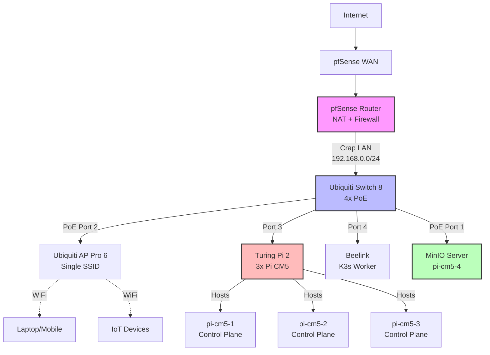
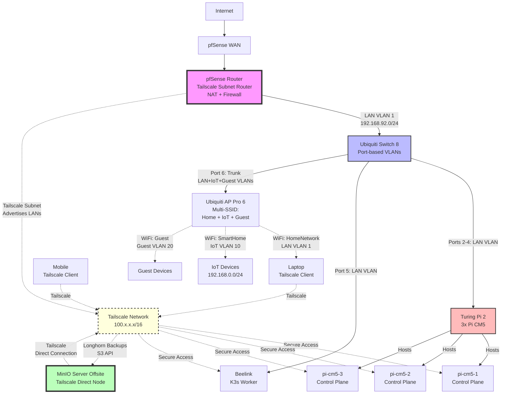

# Network Topology Documentation

**Last Updated**: 2025-11-18
**Status**: Migration Planning
**Target Completion**: Q1 2026

## Overview

This document describes the current network topology and the planned migration to a segmented network with Tailscale remote access, IoT isolation, and offsite backup capabilities.

**Migration Goal**: Transform from single-VLAN architecture to multi-VLAN segmented network with secure remote access via Tailscale while maintaining public service exposure through pfSense port forwarding.

---

## Current Network Topology

### Architecture Diagram



### Current Configuration

| Component | VLAN | IP Range | Notes |
|-----------|------|----------|-------|
| pfSense "Crap LAN" | N/A | 192.168.0.1 | Gateway (current single network) |
| All devices | N/A | 192.168.0.0/24 | Everything on same network currently |
| Ubiquiti Switch | N/A | 192.168.0.2 | Management IP |
| Ubiquiti AP | N/A | 192.168.0.3 | Management IP |
| K3s Nodes | N/A | 192.168.0.11-14 | Should move to LAN VLAN |
| MinIO (pi-cm5-4) | N/A | 192.168.0.15 | Moving offsite |
| Laptop/Mobile | N/A | DHCP (192.168.0.x) | Via WiFi |
| IoT Devices | N/A | DHCP (192.168.0.x) | Via WiFi, no isolation |

**K3s Cluster Network**:
- Pod CIDR: `10.42.0.0/16`
- Service CIDR: `10.43.0.0/16`
- Flannel backend: VXLAN (port 8472/udp)
- Cluster domain: `jardoole.xyz`

**Public Services** (planned):
- Services will be exposed via pfSense port forwarding: WAN:443 → K3s:11443
- Traefik ingress controller on K3s will handle routing to services
- Example: `https://jellyfin.jardoole.xyz`, `https://radarr.jardoole.xyz`

### Current Issues

1. ❌ **No network segmentation** - All devices (servers + IoT) on same VLAN
2. ❌ **IoT devices can access servers** - No firewall isolation
3. ❌ **No remote access** - Cannot access cluster from mobile/laptop securely
4. ❌ **MinIO on local network** - Vulnerable to physical theft
5. ❌ **Single WiFi SSID** - Cannot separate trusted vs untrusted devices

---

## Target Network Topology (Option 1: Hybrid Multi-SSID)

### Architecture Diagram



### Target Configuration

#### Network Segmentation

| Network | VLAN ID | Subnet | Gateway | Purpose |
|---------|---------|--------|---------|---------|
| LAN | 1 (native) | 192.168.92.0/24 | 192.168.92.1 | Servers, admin devices |
| IoT | 10 | 192.168.0.0/24 | 192.168.0.1 | Smart home, cameras (keeps current subnet) |
| Guest | 20 | 192.168.10.0/24 | 192.168.10.1 | Guest WiFi (isolated) |

#### Device Assignments

| Device | VLAN | IP Address | Access Method |
|--------|------|------------|---------------|
| pfSense LAN | 1 | 192.168.92.1 | Direct |
| pfSense IoT | 10 | 192.168.0.1 | Direct |
| pfSense Guest | 20 | 192.168.10.1 | Direct |
| Ubiquiti Switch | 1 | 192.168.92.2 | LAN + Tailscale |
| Ubiquiti AP | 1 | 192.168.92.3 | LAN + Tailscale |
| pi-cm5-1 | 1 | 192.168.92.11 | LAN + Tailscale |
| pi-cm5-2 | 1 | 192.168.92.12 | LAN + Tailscale |
| pi-cm5-3 | 1 | 192.168.92.13 | LAN + Tailscale |
| beelink | 1 | 192.168.92.14 | LAN + Tailscale |
| MinIO (offsite) | N/A | 100.x.x.x (Tailscale) | Tailscale only |
| IoT devices | 10 | 192.168.0.100+ | IoT VLAN via AP |
| Guest devices | 20 | 192.168.10.100+ | Guest VLAN via AP |

#### WiFi SSIDs

| SSID | VLAN | Security | Purpose |
|------|------|----------|---------|
| HomeNetwork | 1 (LAN) | WPA3 | Trusted devices (laptops, phones) |
| SmartHome | 10 (IoT) | WPA2 | IoT devices (cameras, sensors) |
| Guest | 20 (Guest) | WPA2 | Guest/visitor devices (isolated) |

#### Switch Port Configuration

| Port | Mode | VLANs | Connected Device |
|------|------|-------|------------------|
| Port 1 (Uplink) | Trunk | 1, 10, 20 | pfSense LAN interface |
| Port 2 | Access | 1 | pi-cm5-1 (via Turing Pi) |
| Port 3 | Access | 1 | pi-cm5-2 (via Turing Pi) |
| Port 4 | Access | 1 | pi-cm5-3 (via Turing Pi) |
| Port 5 (PoE) | Access | 1 | beelink |
| Port 6 (PoE) | Trunk | 1, 10, 20 | Ubiquiti AP Pro 6 |
| Port 7 | Available | - | Expansion |
| Port 8 | Available | - | Expansion |

**Note**: Port 6 must be trunk to carry LAN (management), IoT (SmartHome SSID), and Guest (Guest SSID) traffic.

---

## Tailscale Configuration

### Tailscale Nodes

| Node | Type | Tailscale IP | Purpose |
|------|------|--------------|---------|
| pfSense | Subnet Router | 100.64.0.1 | Advertises 192.168.92.0/24, 192.168.0.0/24, 192.168.10.0/24 |
| MinIO (offsite) | Direct Node | 100.64.0.10 | Direct connection, S3 backup target |
| Laptop | Client | 100.64.0.20+ | Admin access |
| Mobile | Client | 100.64.0.30+ | Admin access |

### Access Control Lists (ACLs)

```json
{
  "groups": {
    "group:admins": ["user@example.com"],
    "group:k3s-cluster": ["tag:k3s-node"],
    "group:backup-clients": ["tag:k3s-node"]
  },
  "tagOwners": {
    "tag:subnet-router": ["group:admins"],
    "tag:k3s-node": ["group:admins"],
    "tag:offsite-nas": ["group:admins"]
  },
  "acls": [
    {
      "action": "accept",
      "src": ["group:admins"],
      "dst": ["*:22", "*:443", "*:6443", "tag:offsite-nas:9000,9001"]
    },
    {
      "action": "accept",
      "src": ["group:backup-clients"],
      "dst": ["tag:offsite-nas:9000,9001"]
    },
    {
      "action": "accept",
      "src": ["group:admins"],
      "dst": ["192.168.92.0/24:*", "192.168.0.0/24:*", "192.168.10.0/24:*"]
    }
  ]
}
```

**Key Rules**:
- Admins can access all devices (SSH, HTTPS, K8s API, MinIO)
- K3s cluster can push backups to MinIO (ports 9000/9001)
- MinIO **cannot** initiate connections back (deny-by-default)
- Admins can access both LAN and IoT VLANs via subnet router

---

## Firewall Rules

### pfSense Firewall Rules

#### LAN VLAN (192.168.92.0/24) Rules

| Priority | Action | Source | Destination | Ports | Description |
|----------|--------|--------|-------------|-------|-------------|
| 1 | Allow | LAN net | IoT net | Any | Admin can manage IoT devices |
| 2 | Allow | LAN net | Guest net | Any | Admin can manage guest network |
| 3 | Allow | LAN net | Any | Any | LAN has full internet access |
| 4 | Allow | LAN net | pfSense | 443,80 | Web UI access |

#### IoT VLAN (192.168.0.0/24) Rules

| Priority | Action | Source | Destination | Ports | Description |
|----------|--------|--------|-------------|-------|-------------|
| 1 | Allow | IoT net | 192.168.92.11-14 | 443,11443 | **Allow IoT → K3s web services (Jellyfin, etc.)** |
| 2 | Block | IoT net | 192.168.92.0/24 | Any | Block all other LAN access (SSH, etc.) |
| 3 | Block | IoT net | 192.168.10.0/24 | Any | Block guest network access |
| 4 | Block | IoT net | pfSense | 443,80,22 | Block management access |
| 5 | Allow | IoT net | Any | 53 | Allow DNS queries |
| 6 | Allow | IoT net | Any | 80,443 | Allow internet (HTTP/S) |
| 7 | Block | IoT net | Any | Any | Deny all other traffic |

**Note**: Rule 1 allows IoT devices to access web services running on K3s (same ports exposed publicly). This enables smart TVs/tablets to watch Jellyfin while maintaining security.

####Guest VLAN (192.168.10.0/24) Rules

| Priority | Action | Source | Destination | Ports | Description |
|----------|--------|--------|-------------|-------|-------------|
| 1 | Block | Guest net | 192.168.92.0/24 | Any | Block all LAN access |
| 2 | Block | Guest net | 192.168.0.0/24 | Any | Block IoT network access |
| 3 | Block | Guest net | pfSense | 443,80,22 | Block management access |
| 4 | Allow | Guest net | Any | 53 | Allow DNS queries |
| 5 | Allow | Guest net | Any | 80,443 | Allow internet (HTTP/S) only |
| 6 | Block | Guest net | Any | Any | Deny all other traffic |

**Logging**: Enable logging on all "Block" rules for security monitoring.

---

## Public Service Exposure

### Port Forwarding Configuration

Public services are exposed via pfSense port forwarding to the K3s cluster:

```
Internet (HTTPS:443)
  → pfSense Port Forward (WAN:443 → K3s:11443)
    → Traefik Ingress (K3s, listening on :443 and :11443)
      → Application Pods
```

**Configuration**:
- Public port: WAN interface port 443
- Forward to: K3s nodes (192.168.92.11-14) port 11443
- Traefik ingress controller handles routing to services based on hostname
- Separate ingress configured for port 11443 (public) and 443 (internal/IoT)

**Examples**:
- `https://jellyfin.jardoole.xyz` → Routes to Jellyfin pod via Traefik
- `https://radarr.jardoole.xyz` → Routes to Radarr pod via Traefik
- IoT devices access same services on ports 443 or 11443 (firewall rules allow)

**SSL Certificates**: Let's Encrypt via cert-manager with Cloudflare DNS-01 challenge (automated renewal)

**Network Isolation**: Tailscale operates on separate overlay network and does not affect public service exposure.

---

## Comparison: Current vs Target

| Feature | Current State | Target State | Benefit |
|---------|---------------|--------------|---------|
| Network Segmentation | ❌ Single VLAN | ✅ Multi-VLAN (LAN + IoT + Guest) | IoT isolation |
| IoT Access to Servers | ⚠️ Unrestricted | ✅ Limited (web only) | Security hardening |
| Remote Access | ❌ None (or VPN?) | ✅ Tailscale (WireGuard) | Secure mobile/laptop access |
| MinIO Location | ⚠️ Local (theft risk) | ✅ Offsite (Tailscale) | Physical security |
| WiFi Segmentation | ❌ Single SSID | ✅ Multi-SSID (Home/IoT/Guest) | Easy device separation |
| Backup Security | ⚠️ Local network | ✅ Tailscale ACLs | One-way access only |
| Public Services | ✅ Port Forward | ✅ Port Forward (unchanged) | No disruption |
| Management Complexity | 🟢 Low | 🟡 Medium | Worth trade-off |

---

## Implementation Phases

### Phase 1: Testing & Preparation (Week 1-2)

**Goal**: Validate Tailscale connectivity and deploy UniFi Controller

**Tasks**:
1. ✅ Research Tailscale options (completed)
2. Set up Tailscale test account
3. Deploy UniFi Controller on K3s cluster
4. Adopt Ubiquiti switch and AP
5. Test Tailscale on one K3s node
6. Document findings

**Success Criteria**:
- UniFi Controller accessible via web UI
- Switch and AP adopted successfully
- Tailscale client can reach test K3s node
- No disruption to existing services

**Rollback**: Delete test Tailscale node, remove UniFi Controller deployment

---

### Phase 2: VLAN Configuration (Week 3-4)

**Goal**: Create LAN, IoT, and Guest VLANs, configure switch port assignments

**Tasks**:
1. Create LAN VLAN (VLAN 1) in pfSense: 192.168.92.0/24
2. Create IoT VLAN (VLAN 10) in pfSense: 192.168.0.0/24
3. Create Guest VLAN (VLAN 20) in pfSense: 192.168.10.0/24
4. Configure DHCP servers for each VLAN
5. Assign static IPs to K3s nodes (192.168.92.11-14)
6. Configure switch ports (access vs trunk)
7. Test connectivity within each VLAN
8. Document VLAN configuration

**Success Criteria**:
- K3s nodes accessible on LAN VLAN (192.168.92.x)
- IoT devices remain on IoT VLAN (192.168.0.x)
- Guest VLAN configured (192.168.10.x)
- AP management accessible from LAN VLAN
- All devices have working internet access

**Rollback**: Revert switch to default VLAN, restore previous IP assignments

---

### Phase 3: Multi-SSID WiFi (Week 5)

**Goal**: Configure AP with multiple SSIDs mapped to VLANs

**Tasks**:
1. Create "HomeNetwork" SSID → LAN VLAN (192.168.92.0/24)
2. Create "SmartHome" SSID → IoT VLAN (192.168.0.0/24)
3. Create "Guest" SSID → Guest VLAN (192.168.10.0/24)
4. Set switch port 6 (AP uplink) to trunk mode (VLANs 1, 10, 20)
5. Test WiFi connectivity on all three SSIDs
6. Verify VLAN tagging (devices on correct VLANs)
7. Migrate IoT devices to "SmartHome" SSID

**Success Criteria**:
- Laptop connects to "HomeNetwork", gets 192.168.92.x IP
- IoT devices connect to "SmartHome", get 192.168.0.x IPs
- Guest devices connect to "Guest", get 192.168.10.x IPs
- All three SSIDs have working internet
- Devices on correct VLANs per `arp -a`

**Rollback**: Disable "SmartHome" and "Guest" SSIDs, revert to single SSID

---

### Phase 4: Firewall Rules (Week 6)

**Goal**: Implement IoT and Guest isolation firewall rules

**Tasks**:
1. Create IoT → K3s web services allow rule (ports 443, 11443)
2. Create IoT → LAN block rule (all other traffic)
3. Create IoT → Guest block rule
4. Create IoT → pfSense management block rule
5. Create IoT → Internet allow rule (DNS, HTTP/S)
6. Create Guest → LAN/IoT block rules
7. Create Guest → Internet allow rule (DNS, HTTP/S only)
8. Enable logging on all block rules
9. Test IoT device CAN reach K3s web services (Jellyfin)
10. Test IoT device CANNOT reach K3s SSH
11. Test Guest device CANNOT reach any internal networks
12. Monitor firewall logs for violations

**Success Criteria**:
- IoT device **can** access https://192.168.92.11 (Jellyfin on K3s)
- IoT device **cannot** SSH to 192.168.92.11 (K3s node)
- IoT device **cannot** access https://192.168.92.1 (pfSense UI)
- Guest device **cannot** ping 192.168.92.11 (K3s node)
- Guest device **cannot** ping 192.168.0.100 (IoT device)
- All devices **can** ping 8.8.8.8 (internet)
- All devices **can** resolve DNS queries
- Firewall logs show blocked attempts

**Rollback**: Disable IoT and Guest firewall rules, restore any-to-any access

---

### Phase 5: Tailscale Deployment (Week 7-8)

**Goal**: Deploy Tailscale subnet router on pfSense and direct node on MinIO

**Tasks**:
1. Install Tailscale package on pfSense
2. Generate pre-auth key (reusable, tag: `tag:subnet-router`)
3. Configure pfSense Tailscale to advertise:
   - 192.168.92.0/24 (LAN)
   - 192.168.0.0/24 (IoT)
   - 192.168.10.0/24 (Guest)
4. Approve routes in Tailscale admin console
5. Install Tailscale on MinIO server
6. Tag MinIO: `tag:offsite-nas`
7. Configure Tailscale ACLs (one-way access)
8. Test connectivity: Laptop → MinIO via Tailscale
9. Test connectivity: Laptop → K3s nodes via Tailscale subnet router

**Success Criteria**:
- Laptop (Tailscale) can SSH to pi-cm5-1 via 192.168.92.11
- Laptop (Tailscale) can access MinIO S3 API via `http://100.x.x.x:9000`
- MinIO **cannot** ping/access K3s nodes
- Tailscale shows "subnets advertised" on pfSense node
- Can access all three VLANs from Tailscale clients

**Rollback**: Remove Tailscale from pfSense and MinIO, revoke auth keys

---

### Phase 6: MinIO Migration (Week 9-10)

**Goal**: Move MinIO offsite, update Longhorn backup target

**Tasks**:
1. Update Longhorn backup target to MinIO Tailscale IP:
   ```yaml
   # Before: http://pi-cm5-4.local:9000
   # After: http://100.x.x.x:9000
   ```
2. Test Longhorn backup job (manual trigger)
3. Verify backup appears in MinIO bucket
4. Document MinIO Tailscale IP for disaster recovery
5. Physically move MinIO to offsite location
6. Power on MinIO, verify Tailscale connection
7. Trigger full Longhorn backup suite
8. Monitor backup success

**Success Criteria**:
- Longhorn backups succeed via Tailscale IP
- MinIO reachable from offsite location
- Backup data integrity verified (random restore test)
- No public exposure of MinIO (port scan shows closed)

**Rollback**:
- Restore MinIO to local network
- Revert Longhorn backup target to local IP
- Keep Tailscale configured for future retry

---

### Phase 7: Validation & Documentation (Week 11-12)

**Goal**: Comprehensive testing and documentation updates

**Tasks**:
1. Perform disaster recovery test:
   - Restore one PVC from MinIO backup
   - Verify data integrity
2. Security audit:
   - Verify IoT devices cannot reach LAN
   - Verify MinIO cannot initiate connections to cluster
   - Port scan pfSense from internet (verify no new exposures)
3. Performance test:
   - Measure Tailscale throughput for backups
   - Baseline HAProxy response times (ensure unchanged)
4. Update documentation:
   - `docs/network-topology.md` (this document)
   - `docs/disaster-recovery.md` (new, MinIO restore procedures)
   - `docs/pfsense-integration-architecture.md` (add Tailscale section)
5. Create runbook for common operations:
   - Adding new device to Tailscale
   - Onboarding new IoT device
   - Troubleshooting VLAN issues

**Success Criteria**:
- PVC restore succeeds from offsite MinIO
- IoT isolation confirmed (cannot access LAN except web services on 192.168.92.11-14:443,11443)
- Guest isolation confirmed (cannot access any internal networks)
- MinIO isolation confirmed (ACLs enforced)
- Public services unchanged (Jellyfin, Radarr, etc. still accessible)
- Documentation complete and reviewed

**No rollback** - migration complete!

---

## Risk Assessment & Mitigation

### High-Risk Items

| Risk | Impact | Probability | Mitigation |
|------|--------|-------------|------------|
| Misconfigured firewall rules break K3s cluster | 🔴 Critical | 🟡 Medium | Test rules in lab first, have console access to pfSense |
| Tailscale subnet router failure breaks remote access | 🟡 Medium | 🟢 Low | Keep MinIO as direct node (independent access) |
| VLAN misconfiguration causes network outage | 🔴 Critical | 🟡 Medium | Document rollback steps, test during low-usage window |
| MinIO offsite loses Tailscale connectivity | 🟡 Medium | 🟡 Medium | Monitor Tailscale status, have alternate access method |
| UniFi Controller failure prevents switch management | 🟢 Low | 🟢 Low | Can factory reset switch and reconfigure manually |

### Rollback Strategy

Each phase includes specific rollback procedures. General rollback principles:

1. **Network changes**: Keep pfSense console access (physical keyboard/monitor)
2. **Service changes**: Test Longhorn backups before AND after each phase
3. **Configuration backup**: Export pfSense config before changes
4. **Documentation**: Maintain "before" and "after" network diagrams

---

## Monitoring & Maintenance

### Ongoing Monitoring

1. **Firewall Logs** (pfSense):
   - Monitor IoT → LAN block attempts
   - Alert on unexpected traffic patterns

2. **Tailscale Status**:
   - Check Tailscale admin console for node health
   - Monitor DERP relay usage (should be minimal)
   - Verify subnet routes advertised

3. **Backup Jobs** (Longhorn):
   - Daily: Verify backup success (via Longhorn UI)
   - Weekly: Test restore of one PVC
   - Monthly: Full disaster recovery drill

4. **Network Performance**:
   - Baseline Tailscale throughput: `iperf3` between laptop and K3s node
   - Monitor HAProxy response times (Grafana dashboard)

### Maintenance Tasks

**Monthly**:
- Review Tailscale ACLs for accuracy
- Audit IoT device list (remove stale devices)
- Verify MinIO reachable from offsite

**Quarterly**:
- Update Tailscale clients (pfSense, MinIO)
- Review firewall rules for optimization
- Test disaster recovery procedures

**Annually**:
- Audit entire network topology
- Review security posture
- Plan future enhancements

---

## Future Enhancements

### Potential Additions

1. **Guest WiFi VLAN** (VLAN 20):
   - Isolated network for visitors
   - Portal-based authentication
   - Time-limited access

2. **Tailscale on Individual K3s Nodes**:
   - Upgrade to per-node Tailscale for granular ACLs
   - Better performance than subnet router for some use cases

3. **Network Monitoring Stack**:
   - Deploy Prometheus + Grafana for network metrics
   - Monitor VLAN traffic, firewall rule hits
   - Alert on anomalies

4. **Automated Failover**:
   - Secondary MinIO location (geographic redundancy)
   - Automated Tailscale route failover

5. **IPv6 Support**:
   - Enable IPv6 on all VLANs
   - Configure Tailscale IPv6

---

## Troubleshooting

### Common Issues

#### 1. Device Cannot Reach Internet After VLAN Migration

**Symptoms**: Device gets IP but no internet connectivity

**Diagnosis**:
```bash
# Check DHCP assignment
ip addr show

# Check gateway
ip route show

# Test DNS
nslookup google.com

# Test gateway ping
ping 192.168.92.1
```

**Solutions**:
- Verify DHCP server configured on VLAN
- Check firewall rules (allow VLAN → Internet)
- Verify NAT rules in pfSense

#### 2. IoT Device Can Reach LAN Beyond Web Services

**Symptoms**: IoT device (192.168.0.x) can SSH to K3s node (192.168.92.x)

**Diagnosis**:
```bash
# From IoT device
ssh 192.168.92.11  # Should be blocked

# Check if web services work (should be allowed)
curl https://192.168.92.11  # Should work

# Check pfSense firewall logs
# Firewall > Logs > Firewall
```

**Solutions**:
- Verify IoT → K3s web services allow rule (ports 443, 11443) has priority 1
- Verify IoT → LAN block rule exists and comes AFTER the allow rule
- Check rule priority ordering
- Ensure rules apply to IoT interface

#### 3. Tailscale Cannot Reach Subnet

**Symptoms**: Laptop (Tailscale) cannot access 192.168.92.11

**Diagnosis**:
```bash
# From laptop
tailscale status  # Check if pfSense online
tailscale ping 100.64.0.1  # Ping pfSense Tailscale IP
ping 192.168.92.11  # Test subnet access
```

**Solutions**:
- Verify subnet routes approved in Tailscale console
- Check pfSense Tailscale config (subnet advertising enabled: 192.168.92.0/24, 192.168.0.0/24, 192.168.10.0/24)
- Verify pfSense firewall allows Tailscale → LAN
- Check Tailscale ACLs allow access to advertised subnets

#### 4. Longhorn Backup Fails After MinIO Migration

**Symptoms**: Backup job shows error, cannot connect to MinIO

**Diagnosis**:
```bash
# From K3s node
curl http://100.x.x.x:9000  # Test MinIO connectivity
tailscale ping 100.x.x.x  # Test Tailscale to MinIO
kubectl logs -n longhorn-system <backup-pod>
```

**Solutions**:
- Verify MinIO Tailscale node is online
- Check Tailscale ACLs allow K3s → MinIO:9000,9001
- Verify Longhorn backup target URL updated
- Check MinIO credentials in Longhorn secret

---

## Related Documentation

- [pfSense Integration Architecture](pfsense-integration-architecture.md) - Port forwarding and SSL setup
- [Tailscale Setup Guide](tailscale-setup.md) - Detailed Tailscale configuration
- [VLAN Configuration Guide](vlan-configuration.md) - pfSense and Ubiquiti VLAN setup
- [UniFi Controller Deployment](unifi-controller-deployment.md) - Deploy controller on K3s
- [Longhorn Disaster Recovery](longhorn-disaster-recovery.md) - Backup and restore procedures
- [Project Structure](project-structure.md) - Overall project architecture

---

## Appendix: IP Address Allocation

### LAN VLAN (192.168.92.0/24)

| IP Address | Hostname | Device Type | Notes |
|------------|----------|-------------|-------|
| 192.168.92.1 | pfsense.local | pfSense Gateway | Static |
| 192.168.92.2 | switch.local | Ubiquiti Switch 8 | Static |
| 192.168.92.3 | ap.local | Ubiquiti AP Pro 6 | Static |
| 192.168.92.10 | - | Reserved | - |
| 192.168.92.11 | pi-cm5-1 | K3s Control Plane 1 | Static |
| 192.168.92.12 | pi-cm5-2 | K3s Control Plane 2 | Static |
| 192.168.92.13 | pi-cm5-3 | K3s Control Plane 3 | Static |
| 192.168.92.14 | beelink | K3s Worker | Static |
| 192.168.92.15-99 | - | Reserved for infrastructure | - |
| 192.168.92.100-200 | - | DHCP pool (admin devices) | Dynamic |
| 192.168.92.201-254 | - | Reserved | - |

### IoT VLAN (192.168.0.0/24)

| IP Address | Hostname | Device Type | Notes |
|------------|----------|-------------|-------|
| 192.168.0.1 | pfsense-iot | pfSense Gateway | Static |
| 192.168.0.2-99 | - | Reserved | - |
| 192.168.0.100-250 | - | DHCP pool (IoT devices) | Dynamic |
| 192.168.0.251-254 | - | Reserved | - |

### Guest VLAN (192.168.10.0/24)

| IP Address | Hostname | Device Type | Notes |
|------------|----------|-------------|-------|
| 192.168.10.1 | pfsense-guest | pfSense Gateway | Static |
| 192.168.10.2-99 | - | Reserved | - |
| 192.168.10.100-250 | - | DHCP pool (Guest devices) | Dynamic |
| 192.168.10.251-254 | - | Reserved | - |

### Tailscale Network (100.64.0.0/10)

**Note**: Tailscale automatically assigns IPs from CGNAT range. These are examples.

| Tailscale IP | Device | Type | Notes |
|--------------|--------|------|-------|
| 100.64.0.1 | pfSense | Subnet Router | Advertises 192.168.92.0/24, 192.168.0.0/24, 192.168.10.0/24 |
| 100.64.0.10 | MinIO (offsite) | Direct Node | S3 backup target |
| 100.64.0.20+ | Laptop | Client | Admin access |
| 100.64.0.30+ | Mobile | Client | Admin access |

---

**End of Network Topology Documentation**
